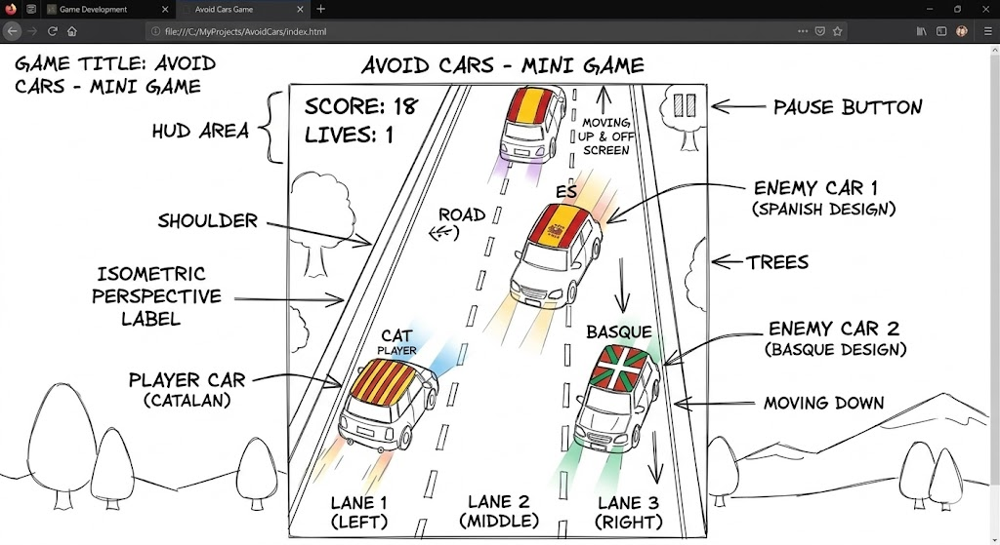

# CarsMcQuenn
 The player controls a car moving on the road and tries to avoid other oncoming cars. The goal is to survive as long as possible and get the highest score.  In the game, the car can move left and right. Oncoming cars appear in random lanes and the game becomes more difficult over time. Each successfully avoided car earns the player points.
